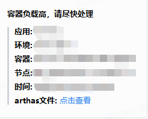
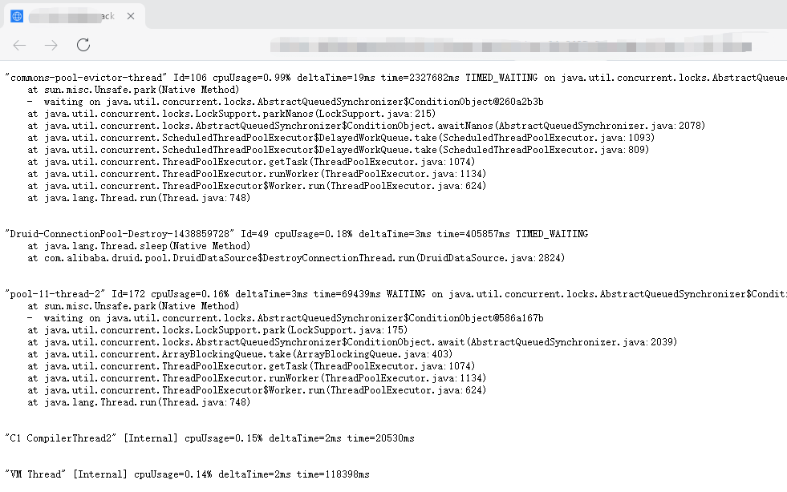
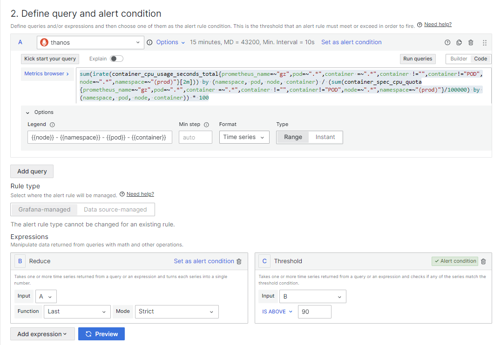
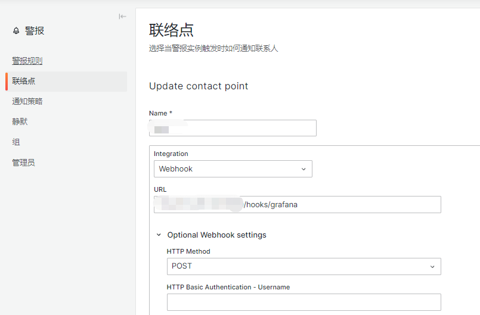

# Pod高负载自动打印JAVA线程堆栈

## 背景

在实际的k8s维护场景中，我们时常会遇到 Pod CPU 突刺的现象。由于信息捕获依赖人工采集，有时甚至还未完成信息捕获，问题就已经恢复了，这让人非常头大。因此，我们需要一个可以自动捕获信息的工具。在GitHub上，我们发现了一个不错的项目k8s-java-debug-daemon，但由于年久失修，已无法满足当前环境的运行需求，所以我们决定对该项目进行二次开发。

## 优化内容

* 支持新版的Grafana、Prometheus
* 支持企业微信告警
* 支持k8s部署
* 支持configmap进行配置
* 支持arthas-boot.jar通过远程拷贝（适用于极简容器没有curl场景）
* 修复n多已知问题

## 工作流程

### **Grafana告警**

与 Grafana 的告警联动，配合阿里的 arthas，来完成高CPU使用率线程的堆栈抓取。

整体流程如下：

1. 为 Grafana 添加 webhook 类型的告警通知渠道，地址为该程序的 url(默认的hooks路径为 /hooks/grafana)。
2. 配置Grafana图表，并设置告警阈值
3. 当 webhook 触发时，程序会自动将 crawl.sh 脚本拷贝到对应 Pod 的容器中并执行。
4. 程序将 stdout 保存到本地文件，并推送到企业微信。

### **Prometheus告警**

与 Prometheus Alertmanager 的告警联动，配合阿里的 arthas，来完成高CPU使用率线程的堆栈抓取。  

整体流程如下：

1. 为 Prometheus 添加告警规则，并设置告警阈值。
2. 为 Alertmanager 配置route规则和receiver，当alertname等于HighPodCPUUsage时，将告警信息回调该程序的url(默认的hooks路径为 /hooks/prometheus)。
3. 当 webhook 触发时，程序会自动将 crawl.sh 脚本拷贝到对应 Pod 的容器中并执行。
4. 程序将 stdout 保存到本地文件，并推送到企业微信。

## 效果预览

* **企业微信告警展示**



* **“点击查看”跳转访问arthas捕获的线程堆栈**



* **通过web浏览arthas捕获的线程信息**

```text
http://xxxxxx:8099/stacks/
```


## 支持环境
Grafana v10.x (v9.x应该也支持，未测试)

## 配置说明

- config/config.yaml配置项

```yaml
server:
  port: 8099  # 服务监听端口
  maxNodeLockManager: 10 # 每node同时运行执行数为10
  domain: "http://127.0.0.1:8099" # 服务监听域名

wework:
  webhook: "https://qyapi.weixin.qq.com/cgi-bin/webhook/send?key=xxxxxxx" # 企业微信webhook地址

arthas:
  remoteCopy: true  # 是否远程拷贝arthas,值为false时将通过crawl.sh脚本进行下载
  path: "tools/arthas-boot.jar" #arthas-boot.jar源的存放路径
```
- 默认取最繁忙的前50个线程的堆栈信息 (可在 `crawl.sh` 中修改)
- 采集样本时间为2秒 (可在 `crawl.sh` 中修改)

## 如何使用

### Docker镜像

* 这是编译好的镜像，可以直接拉取使用

```text
docker pull registry.cn-hangzhou.aliyuncs.com/yilingyi/k8s-java-thread-dumper:2.1.0
```

* 自行构建

拉取源码
```text
git clone https://github.com/yilingyi/k8s-java-thread-dumper.git
```

构建镜像
```text
make docker IMAGE=yilingyi/k8s-java-thread-dumper:2.1.0
```

### Kubernetes部署

* 创建命名空间monitor

```text
kubectl create namespace monitor
```

* 将下面三个文件放在同一目录下，并使用`kubectl apply -f . -n monitor`进行k8s资源创建

Deployment.yaml
```yaml
apiVersion: apps/v1
kind: Deployment
metadata:
  name: k8s-java-thread-dumper
  labels:
    app: k8s-java-thread-dumper
spec:
  replicas: 1
  selector:
    matchLabels:
      app: k8s-java-thread-dumper
  template:
    metadata:
      labels:
        app: k8s-java-thread-dumper
    spec:
      containers:
      - name: k8s-java-thread-dumper
        image: registry.cn-hangzhou.aliyuncs.com/yilingyi/k8s-java-thread-dumper:2.1.0
        ports:
        - containerPort: 8099
        volumeMounts:
        - name: config-volume
          mountPath: /app/config/config.yaml
          subPath: config.yaml
      volumes:
      - name: config-volume
        configMap:
          name: k8s-java-thread-dumper-config
```

Service.yaml
```yaml
apiVersion: v1
kind: Service
metadata:
  name: k8s-java-thread-dumper-service
  labels:
    app: k8s-java-thread-dumper
spec:
  selector:
    app: k8s-java-thread-dumper
  ports:
  - protocol: TCP
    port: 8099
    targetPort: 8099
  type: NodePort
```

ConfigMap.yaml
```yaml
apiVersion: v1
kind: ConfigMap
metadata:
  name: k8s-java-thread-dumper-config
data:
  config.yaml: |
    server:
      port: 8099
      maxNodeLockManager: 10
      domain: "http://xxxxx:8099"
    wework:
      webhook: "https://qyapi.weixin.qq.com/cgi-bin/webhook/send?key=xxxxxxx"
    arthas:
      remoteCopy: true
      path: "tools/arthas-boot.jar"
```
* 资源授权

保存为rolebinding.yaml，并使用`kubectl apply -f rolebinding.yaml`进行创建，其中`<target-namespace>`改为目标命名空间

```text
kind: Role
apiVersion: rbac.authorization.k8s.io/v1
metadata:
  namespace: <target-namespace>
  name: pod-exec-role
rules:
- apiGroups: [""]
  resources: ["pods/exec"]
  verbs: ["create"]

---
kind: RoleBinding
apiVersion: rbac.authorization.k8s.io/v1
metadata:
  name: pod-exec-role-binding
  namespace: <target-namespace>
subjects:
- kind: ServiceAccount
  name: default
  namespace: monitor
roleRef:
  kind: Role
  name: pod-exec-role
  apiGroup: rbac.authorization.k8s.io
```
#### 回调接口
* Grafana webhook 回调地址

```text
http://xxxxxx:8099/hooks/grafana
```

* Prometheus webhook 回调地址

```text
http://xxxxxx:8099/hooks/prometheus
```

#### Grafana告警规则

* Metrics Browser中填写

```text
sum(irate(container_cpu_usage_seconds_total{prometheus_name=~"gz",pod=~".*",container =~".*",container !="",container!="POD",node=~".*",namespace=~"(prod)"}[2m])) by (namespace, pod, node, container) / (sum(container_spec_cpu_quota{prometheus_name=~"gz",pod=~".*",container =~".*",container !="",container!="POD",node=~".*",namespace=~"(prod)"}/100000) by (namespace, pod, node, container)) * 100
```

Legend 中填写

```text
{{node}} - {{namespace}} - {{pod}} - {{container}}
```

配置完如下：


* 联络点配置

选择webhook,URL地址为http://xxxxx/hooks/grafana

配置完如下：


#### Prometheus&Alertmanager告警规则

* Prometheus告警规则

```text
rules:
  - alert: HighPodCPUUsage
    expr: sum(irate(container_cpu_usage_seconds_total{prometheus_name=~"gz",pod=~".*",container =~".*",container !="",container!="POD",node=~".*",namespace=~"(prod)"}[2m])) by (namespace, pod, node, container) / (sum(container_spec_cpu_quota{prometheus_name=~"gz",pod=~".*",container =~".*",container !="",container!="POD",node=~".*",namespace=~"(prod)"}/100000) by (namespace, pod, node, container)) * 100 > 90
    for: 5m
    labels:
      severity: critical
    annotations:
      summary: "High CPU usage detected on pod {{ $labels.pod }} in namespace {{ $labels.namespace }}"
      description: "CPU usage is above 90% for more than 5 minutes.\n  VALUE = {{ $value }}\n  POD = {{ $labels.pod }}\n  NAMESPACE = {{ $labels.namespace }}"
```

* Alertmanager规则配置

新增路由，将alertname为HighPodCPUUsage的告警发送到receiver：high-pod-cpu-usage，然后回调接口http://xxxxx/hooks/prometheus

```text
global:
  resolve_timeout: 5m

route:
  group_by: ['alertname']
  group_wait: 30s
  group_interval: 5m
  repeat_interval: 12h
  receiver: 'default'

  routes:
  - match:
      alertname: 'HighPodCPUUsage'
    receiver: 'high-pod-cpu-usage'

receivers:
- name: 'default'
  webhook_configs:
  - url: 'http://default-webhook-url/api/v1/alerts'

- name: 'high-pod-cpu-usage'
  webhook_configs:
  - url: 'http://xxxxx/hooks/prometheus'
```

## **欢迎订阅我的公众号「SRE运维手记」**


参考链接
https://github.com/majian159/k8s-java-debug-daemon.git